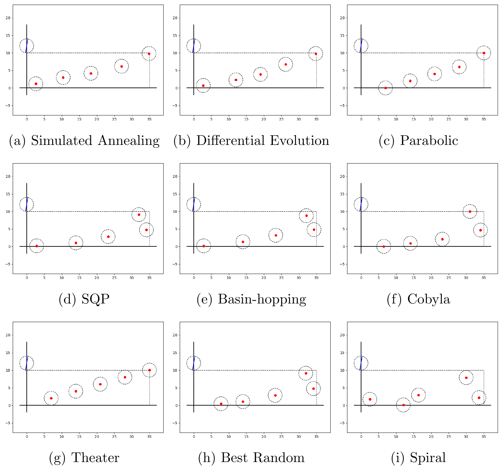

# math-mods-camp

## How-to

### Dependencies

* Python 3
* `numpy`
* `matplotlib` for drawing
* `pandas` - only for showing the results in dataframes

### Evaluation
To evaluate a layout, see `run.py` script in [`src`](https://github.com/markolalovic/math-mods-camp/tree/main/src) directory, and execute `python3 run.py`.

See also [`Toy-Model.ipynb`](https://github.com/markolalovic/math-mods-camp/blob/main/notebooks/Toy-Model.ipynb) notebook in [`notebooks`](https://github.com/markolalovic/math-mods-camp/tree/main/notebooks) directory.

### Files
To create a new layout for evaluation and testing using the Tiny Plant, you have to write a list of `n=5` heliostat coordinates `[xi, yi]` in the following format:

`[[x1, y1], [x2, y2], ..., [xn, yn]]`

and save it as `name-of-layout.json` to `data/layouts` directory.

For the layout to be valid, the coordinates have to be in the Tiny Plants field area:
```
0 <= xi <= 35
0 <= yi <= 10
```

Heliostats must not be too close, they have to be at least 2 times the radius of a bounding circle appart, this distance is equal to heliostat size:

```
|(xi, yi) - (xj, yj)| >= 4
```

And heliostats must not be too close to the receiver
```
|(xi, yi) - (0, 12)| >= 4
```

See the existing layouts in [`data/layouts`](https://github.com/markolalovic/math-mods-camp/tree/main/data/layouts), for example: [grid-layout.json](https://raw.githubusercontent.com/markolalovic/math-mods-camp/main/data/layouts/grid-layout.json) with coordinates for 5 heliostats.

## Instructions
If you happen to find some high energy layout for the Toy model, try to contribute it by doing the pull request. If you find it by running some algorithm, also try to push the code. Be aware that if you only got a small increase in energy, it can be that your layout is only exploiting the inaccuracies in the model, i.e. now the Toy model is using only a few angles in order to run faster. For final evaluation, I will try increasing the number of angles we consider and re-evaluate the layouts to see which layout is only exploiting the inaccuracies in the model that are caused by using too few sun angles.

## Evaluation results

Below are the current results for a few basic layouts evaluated on the Tiny plant:
<p align="left">

</p>

|         Layout     |    Energy  |
|--------------------|------------|
| Simulated Annealing   |   65.32    |
| Differential Evolution          |   65.14    |
| Parabolic   |   63.14    |
| SQP         |   61.34    |
| Basin-hopping |   61.14    |
| Cobyla      |   61.04    |
| Theater     |   60.64    |
| Best Random |   59.26    |
| Spiral      |   55.62    |
| Grid        |   48.22    |
| Tiny        |   45.19    |

## Final results

Increasing the the number of Sun angles we consider from 17 to 180, and number of heliostat rays from 5 to 50, we get the following results:

|         Layout     |    Energy  |
|--------------------|------------|
| Parabolic   |   717.42    |
| Differential Evolution          |   693.42    |
| Theater     |  693.34    |
| Simulated Annealing   |  692.04   |
| Cobyla      |   685.48    |
| Best Random |   677.48    |
| SQP         |   655.44    |
| Basin-hopping |   652.77  |
| Spiral      |   593.12    |
| Grid        |   534.99    |
| Tiny        |   522.43    |